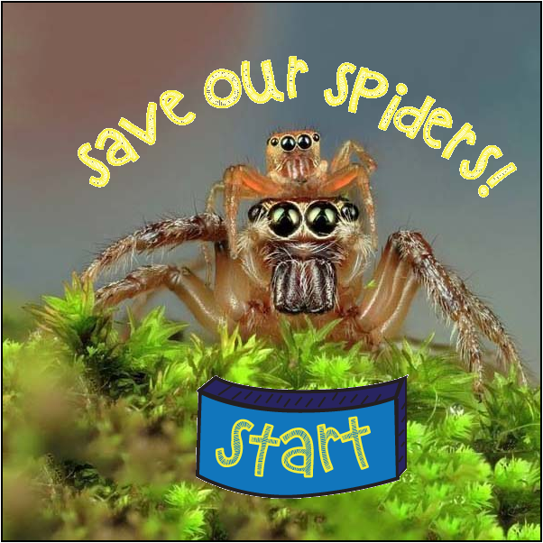
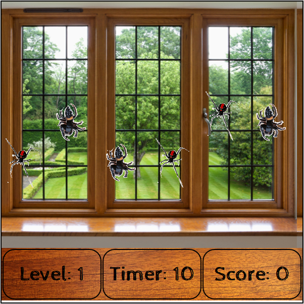
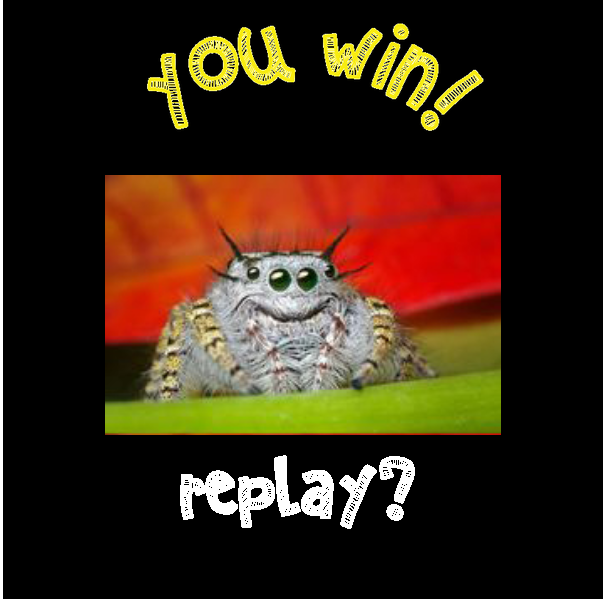

#SAVE OUR SPIDERS!

"Save Our Spiders!" is a game that gives the user an opportunity to practice recognizing deadly spiders.

|Table of Contents|
|-----------------|
|[1. Links](#links)|
|[2. Objective](#objective)|
|[3. How It Started](#started)|
|[4. Tools Used](#tools)|
|[5. User Instructions](#user)|
|[6. Later Features](#features)|
|[7. Resources](#resources)|

##<a name="links">Links</a>

[Deployed App](https://winniecluk.github.io/project1/)  
[Github repo](https://github.com/winniecluk/project1)  
[Trello Board](https://trello.com/b/Ic0Emz8c/save-our-spiders)

##<a name="objective">Objective</a>

The object of this game is to correctly identify 13 black widows and kill them in under 30 seconds. Amongst the black widows are also harmless jumping spiders, which the player will have to avoid killing. Killing the correct spider garners a one-point increase while killing the incorrect spider will return a one-point decrease. Players will see an informational screen before the game starts to help them identify each type of spider.

##<a name="user">User Instructions</a>
The user shall click the Start button and then read through the three instructional screens. Every 4 seconds, spiders will descend from the ceiling and ascend back. The user will click on the black widows and will leave the jumping spiders alone. Getting 13 black widows in under one minute will lead to a win outcome; anything less than 13 will lead to a lose outcome.

## <a name="started">How It Started:</a>
It bothers me when people indiscriminately kill living creatures they know nothing about. It bothers me when other people infringe upon the rights of other beings for the sake of their own convenience. Rather than seeing "right" as an artificial construct that only applies to those who participate in the society that formed the contruct, and rather than submitting to the amoral nature of the universe, I believe that we as individuals can create philosophical rights that can be applied to most living creatures. The right to exist without interference is one of these rights.

Therefore, I aim to correct the grave injustice and unfair villainization that has befallen 3,400 species out of the 46,000 in the class Arachnida -- that is, the common household spider. Most spiders people find in their homes are completely harmless. While they will bite if provoked, most of them are afraid of humans and just want to be left alone. Contrary to popular belief, most spiders do not approach people while they are sleeping, though some may occupy the bed after it's already been vacated to eat bedbugs. Spiders also eat mosquitoes, roaches, fleas, flies, ticks -- insects that do transmit disease to human beings. My attempt to correct this misperception of spiders is not a result of cutely anthropomorphizing this entire class; though I do anthropomorphize a spider in the story, I realize some are poisonous and may pose a real risk to one's own safety and well-being. My goal with this game is to normalize the appearance of spiders and help people recognize the difference between species that are poisonous and species that are completely benign to us, and for every player to use reason first rather than succumbing to one of the two reactions that have been senselessly conditioned into our race as a whole: to either kill or run away screaming from a harmless, air-breathing arthropod usually no bigger than the size of one's thumb, for the simple fact that people find their appearance unusual and do not understand their existence. 

## <a name="tools">Tools Used</a>
|Languages Used|Libraries Used|People Used|
|--------------|--------------|-----------|
|HTML/CSS|jQuery|Me|
|Javascript||All Instructors|
|||Testers|

##<a name="features">Features to be added later</a>
- High scores
- Levels
- 3-D effect applied to user console
- Animation and sound when a player scores a point
- More species of spiders
- Cleaner images
- Images that have a different hover and active state

##<a name="resources">Resources</a>
[Identifying Common U.S. House Spiders](visual.ly/harmless-or-deadly-how-identify-common-house-spiders)  
[5 fun facts on the secret lives of jumping spiders](https://oddorganisms.com/2014/05/13/5-fun-facts-on-the-secret-lives-of-jumping-spiders/)  
[National Geographic: Black Widow Spider](http://animals.nationalgeographic.com/animals/bugs/black-widow-spider/)
